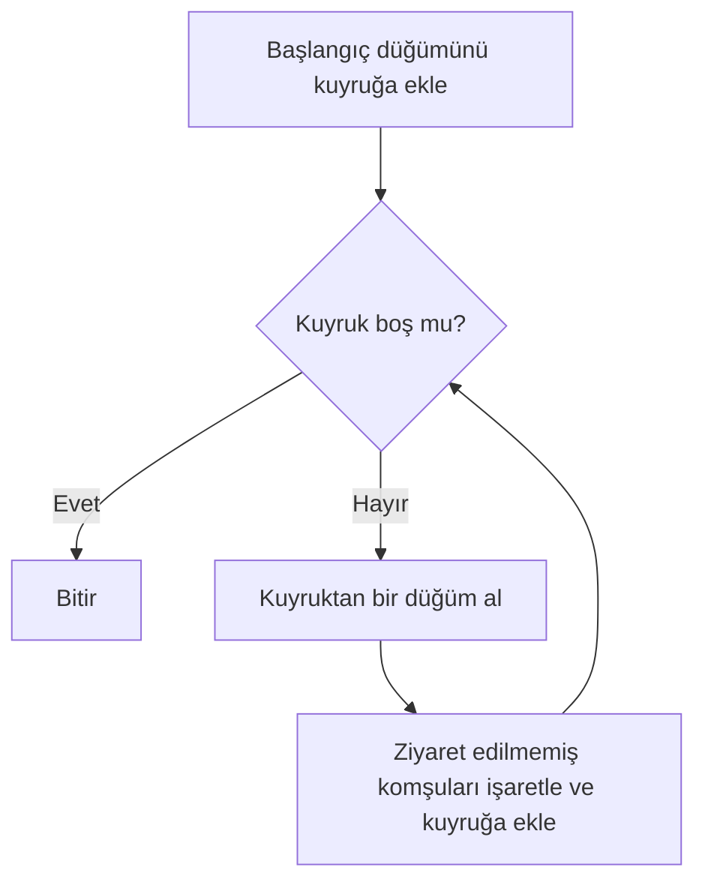
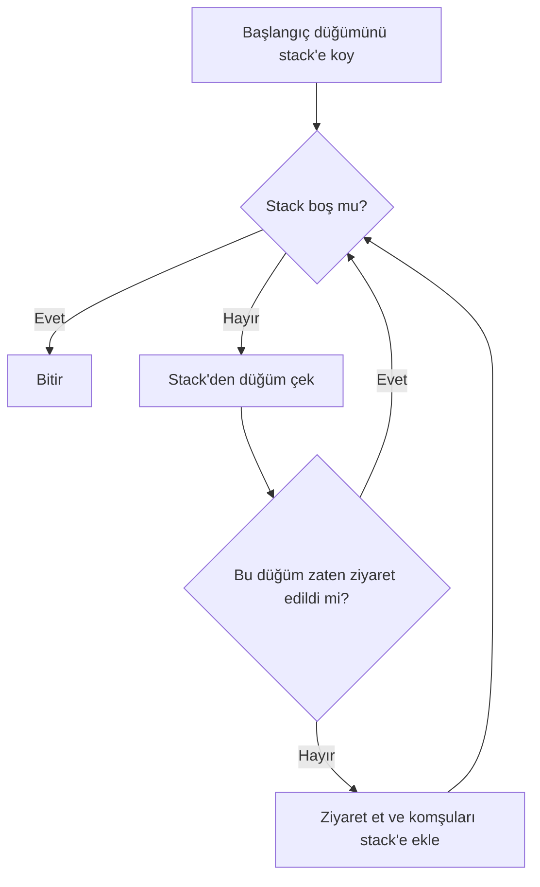
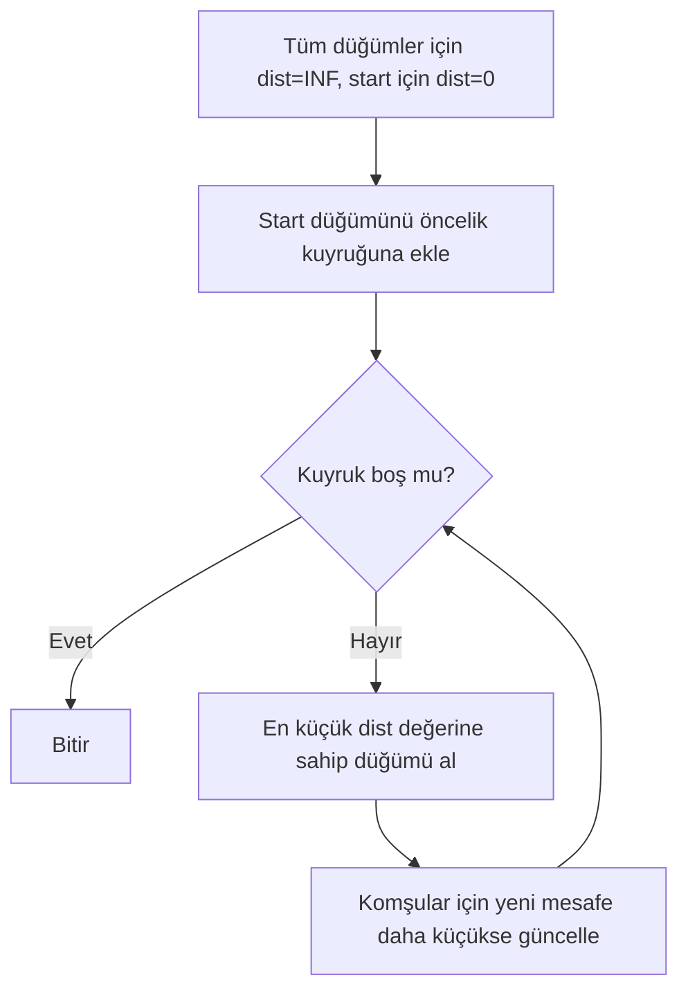
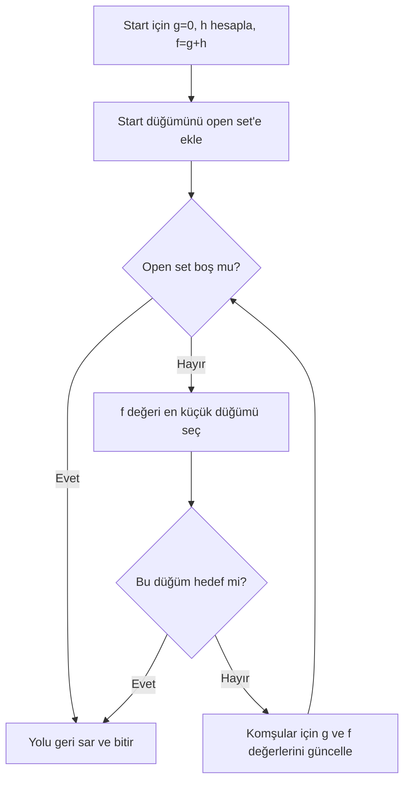
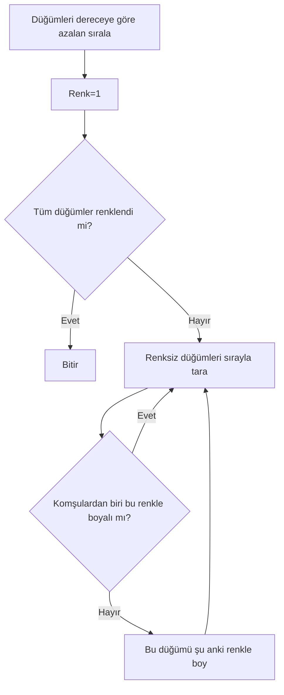
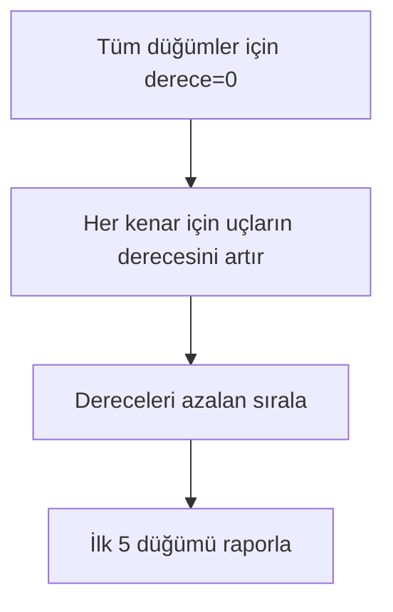
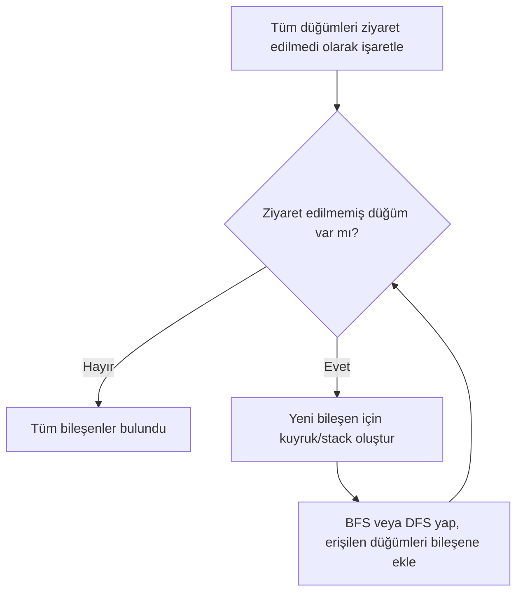
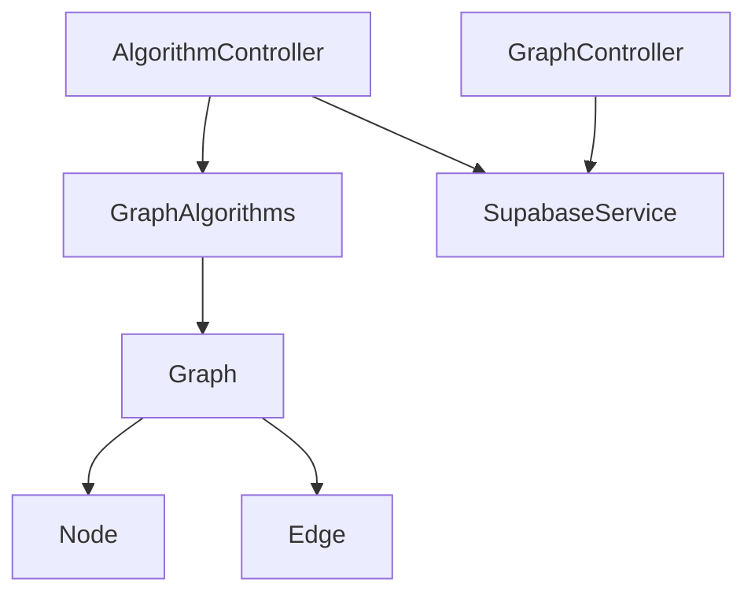

# Sosyal Ağ Analizi

- **Ekip Üyeleri:** Furkan Uğurlu - Caner Çakar
- **Tarih:** 25.12.2025

---

## 1. Giriş

Sosyal ağlarda kullanıcı sayısı arttıkça, aradaki bağlantılar da hızla çoğalır. Bir noktadan sonra,
“Kim kiminle bağlantılı?”, “Aradaki gruplar neler?”, “Kim daha merkezde?” gibi sorulara kağıt kalemle
yanıt vermek zorlaşır.

Bu projede amaç, tarayıcı üzerinde çalışan etkileşimli bir grafik editörüyle sosyal ağ verisini oluşturmak,
Supabase üzerinde saklamak ve çeşitli grafik algoritmalarıyla bu veriyi analiz edip sonuçları hem görsel
hem sayısal olarak göstermektir.

---

## 2. Kullanılan Algoritmalar

Aşağıda projede yer alan temel algoritmalar ve projede nasıl kullanıldıkları yer alıyor.

### 2.1 Genişlik Öncelikli Arama (BFS)

BFS, bir başlangıç düğümünden çıkarak grafı halka halka gezer. Özellikle ağırlıksız (tüm kenarların maliyeti aynı)
graflarda en az adım sayısıyla en kısa yolu bulmak için uygundur.

**Temel adımlar:**

1. Başlangıç düğümünü kuyruğa ekle ve ziyaret edildi olarak işaretle.
2. Kuyruk boşalana kadar sıradaki düğümü al.
3. Bu düğümün komşularına bak, daha önce ziyaret edilmemiş olanları hem işaretle hem de kuyruğa ekle.
4. Tüm düğümler dolaşılana kadar devam et.

**Akış diyagramı (Mermaid):**

Zaman karmaşıklığı `O(V+E)`, bellek karmaşıklığı `O(V)`’dir.

---

### 2.2 Derinlik Öncelikli Arama (DFS)

DFS, bir düğümden başlayıp giderken mümkün olduğunca derine inmeye çalışan, tıkanınca geri dönüp
başka kollara bakan bir dolaşma yöntemidir. Grafın yapısını anlamak, bağlı bileşenleri bulmak gibi
işlerde sık kullanılır.

**Temel adımlar:**

1. Başlangıç düğümünü stack'e ekle.
2. Stack boş değilse, en üstteki düğümü çek.
3. Daha önce ziyaret edildiyse devam et, edilmediyse ziyaret et.
4. Ziyaret edilmemiş komşuları stack'e ekle.
5. Stack boşalana kadar sürdür.

**Akış diyagramı (Mermaid):**

Zaman karmaşıklığı `O(V+E)`, bellek karmaşıklığı `O(V)` civarındadır.

---

### 2.3 Dijkstra Algoritması

Dijkstra, kenar ağırlıkları negatif olmayan graflarda, bir başlangıç düğümünden diğer düğümlere
en küçük toplam maliyetle ulaşan yolları bulmak için kullanılır.

**Temel adımlar:**

1. Tüm düğümler için başlangıçta mesafeyi sonsuz kabul et, sadece başlangıç düğümünün mesafesini sıfır yap.
2. Başlangıç düğümünü öncelik kuyruğuna ekle.
3. Kuyruk boşalana kadar, mesafesi en küçük olan düğümü seç.
4. Bu düğümün komşularına bak, bu düğüm üzerinden gitmek komşunun mevcut mesafesinden daha ucuzsa mesafeyi güncelle.
5. Tüm düğümler işleninceye kadar devam et.

**Akış diyagramı (Mermaid):**

İkili yığın tabanlı öncelik kuyruğu ile zaman karmaşıklığı yaklaşık `O((V+E) log V)`’dir.

---

### 2.4 A\* (A Yıldız) Algoritması

A\*, en kısa yol ararken Dijkstra’ya benzer şekilde çalışır ancak hedefe olan uzaklık için bir tahmin
fonksiyonu kullanır. Özellikle düğümlerin konum bilgisi gibi veriler varsa daha verimli
sonuçlar üretir.

Her düğüm için üç değer tutulur:

- `g`: Başlangıçtan bu düğüme kadar gelen gerçek maliyet
- `h`: Bu düğümden hedefe kadar tahmini maliyet
- `f = g + h`: Toplam skor

**Temel adımlar:**

1. Başlangıç düğümü için `g=0` ve `h` değeri hesaplanır, `f=g+h` bulunur.
2. Başlangıç düğümü açık küme içine alınır.
3. Açık kümede `f` değeri en düşük olan düğüm seçilir.
4. Eğer bu düğüm hedef ise yol geri sarılarak sonuç elde edilir.
5. Değilse komşular için yeni `g` değeri hesaplanır, önceki değerlerden daha iyiyse `g` ve `f` güncellenir.
6. Açık küme boşalana veya hedefe ulaşılana kadar devam edilir.

**Akış diyagramı (Mermaid):**

Uygun bir sezgi fonksiyonu seçildiğinde pratikte Dijkstra’ya göre daha az düğüm ziyaret edilir.
En kötü durumda yine `O((V+E) log V)` mertebesindedir.

---

### 2.5 Welsh–Powell Graf Renklendirme

Welsh–Powell algoritması, komşu düğümlerin aynı renge sahip olmadığı bir graf renklendirmesini hızlı bir şekilde
üretmeyi hedefler. Kullanılan renk sayısı minimal olmak zorunda değildir ancak pratikte yeterli sonuç verir.

**Temel adımlar:**

1. Düğümleri derecelerine göre azalan şekilde sırala.
2. İlk renkten başlayarak, sırayla düğümlere bak ve bu renge sahip komşusu olmayan düğümleri bu renkle boya.
3. Renksiz düğüm kalırsa bir sonraki renge geç ve aynı işlemleri tekrarla.
4. Tüm düğümler renklendiğinde işlem tamamlanır.

**Akış diyagramı (Mermaid):**

Yoğun graflarda zaman karmaşıklığı yaklaşık `O(V² + E)`’dir.

---

### 2.6 Derece Merkezilik (Top 5)

Derece merkeziliği, bir düğümün kaç komşusu olduğunu ölçer. Sosyal ağ bağlamında,
“en çok kişiyle bağlantılı kullanıcılar” bu metrikle görülebilir.

**Temel adımlar:**

1. Tüm düğümler için dereceyi sıfır olarak başlat.
2. Her kenar için iki uç düğümün derecesini birer artır.
3. Düğümleri dereceye göre azalan şekilde sırala.
4. İlk 5 düğümü raporla.

**Akış diyagramı (Mermaid):**

Zaman karmaşıklığı kenarları sayarken `O(E)`, düğümleri sıralarken `O(V log V)` seviyesindedir.

---

### 2.7 Bağlı Bileşenler

Bağlı bileşen analizi, grafı kendi içinde bağlantılı alt parçalara ayırır. Sosyal ağ özelinde, birbirine bağlı kullanıcı
gruplarını ortaya çıkarır.

**Temel adımlar:**

1. Tüm düğümleri ziyaret edilmedi olarak işaretle.
2. Ziyaret edilmemiş bir düğüm bulduğun anda BFS veya DFS başlat.
3. Bu arama ile ulaşılan tüm düğümleri aynı bileşen altında topla.
4. Ziyaret edilmemiş düğüm kalmayana kadar işlemi tekrar et.

**Akış diyagramı (Mermaid):**

Zaman karmaşıklığı `O(V+E)` seviyesindedir.

---

## 3. Sınıf ve Modül Yapısı

### 3.1 Çekirdek (packages/shared)

- `Node`: Bir düğümün kimliği ve taşıdığı veriler.
- `Edge`: İki düğüm arasındaki bağlantı ve kenar ağırlığı.
- `Graph`: Düğüm/kenar ekleme-silme, komşuluk sorguları, veri içe/dışa aktarma gibi temel işlemler.

### 3.2 Algoritmalar (apps/api/src/algorithms)

- BFS ve DFS dolaşma fonksiyonları
- `DijkstraAlgorithm`
- `AStarAlgorithm`
- `WelshPowellColoring`
- `GraphAlgorithms` (genel algoritma servisleri)

### 3.3 Sunucu Katmanı (apps/api)

- `AlgorithmController`: Algoritma isteklerini alır, ilgili algoritmayı çalıştırır ve sonucu JSON olarak döner.
- `GraphController`: Graf verisinin kaydedilmesi, güncellenmesi ve yüklenmesi ile ilgilenir.
- `SupabaseService`: Supabase Postgres ile etkileşimi yönetir.

### 3.4 Ön Uç (apps/web)

- `GraphCanvas`: Düğümlerin ve kenarların çizildiği canvas bileşeni.
- `PropertiesPanel`: Seçili düğüm/kenar özelliklerinin düzenlendiği panel.
- `ResultsTable`: Algoritma sonuçlarının listelendiği tablo.
- `useGraphStore`: Zustand tabanlı global durum yönetimi.

**Sınıf ilişkileri (Mermaid):**

---

## 4. Uygulama Kullanımı

- Canvas üzerinde çift tıklayarak düğüm eklenir.
- Düğümler sürükle-bırak ile taşınabilir.
- İki düğüm arasında kenar oluşturmak için belirlenen kısayollar kullanılır (örneğin `Shift + tık`).
- Yan panelden düğüm ve kenar özellikleri düzenlenebilir, silme işlemleri yapılabilir.
- Üst araç çubuğundan rastgele grafik üretme, grafı temizleme, JSON/CSV içe ve dışa aktarma,
  Supabase’e kaydetme ve yükleme işlemleri yapılır.
- Algoritma butonları üzerinden BFS, DFS, Dijkstra, A\*, derece merkezilik, bağlı bileşenler ve graf renklendirme
  çalıştırılabilir.
- Sonuçlar hem tabloda hem de graf üzerinde renk/işaretleme ile gösterilir.

---

## 5. Genel Değerlendirme

### 5.1 Sağlanan Özellikler

- Tarayıcıda etkileşimli sosyal ağ editörü
- Temel kısa yol ve dolaşma algoritmalarının uygulanması ve görselleştirilmesi
- Supabase ile kalıcı veri saklama (kaydetme/yükleme)
- JSON/CSV formatında dışa ve içe aktarma

### 5.2 Sınırlılıklar

- Supabase erişim bilgileri olmadan kalıcı saklama yapılamaz.
- Kimlik doğrulama, yetkilendirme gibi konular henüz eklenmemiştir.
- Çok büyük graflarda (örneğin 100+ düğüm) canvas etkileşimi ve algoritmaların çalışması daha uzun sürebilir.
